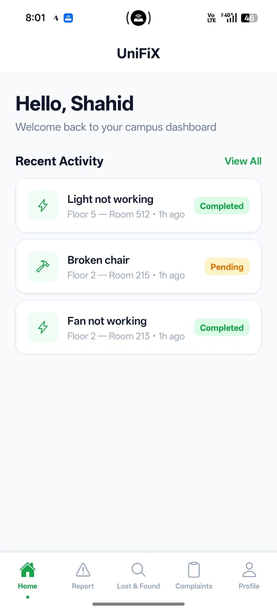
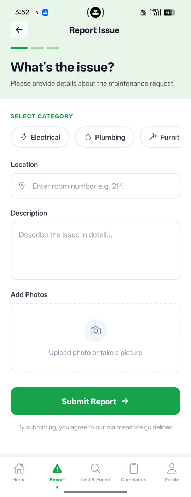
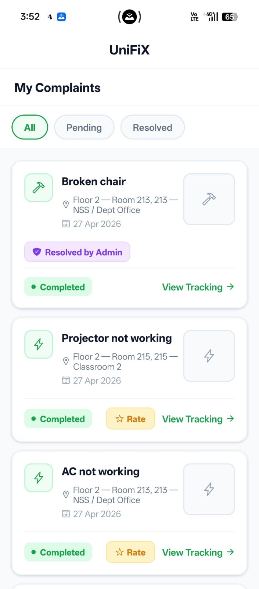
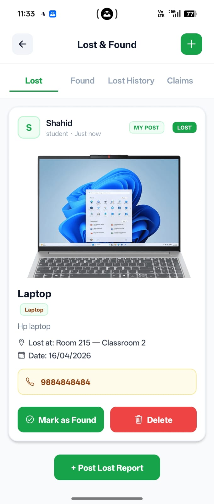
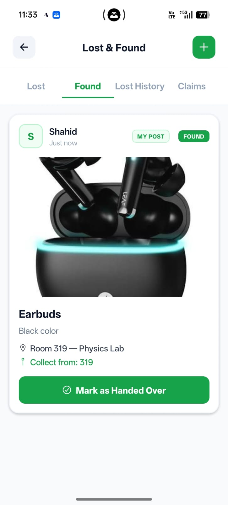
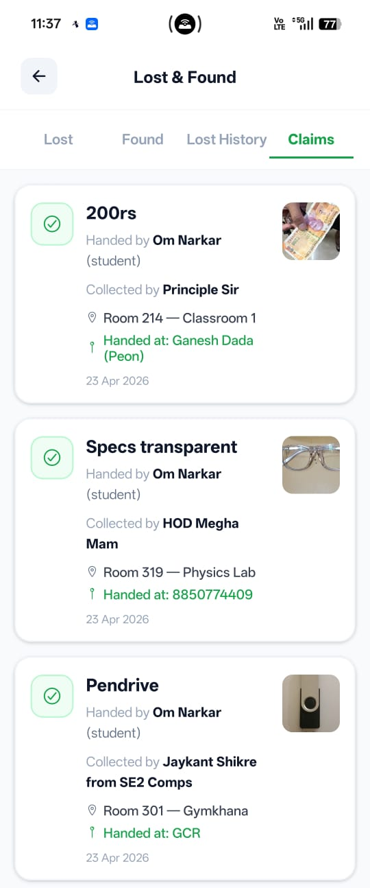
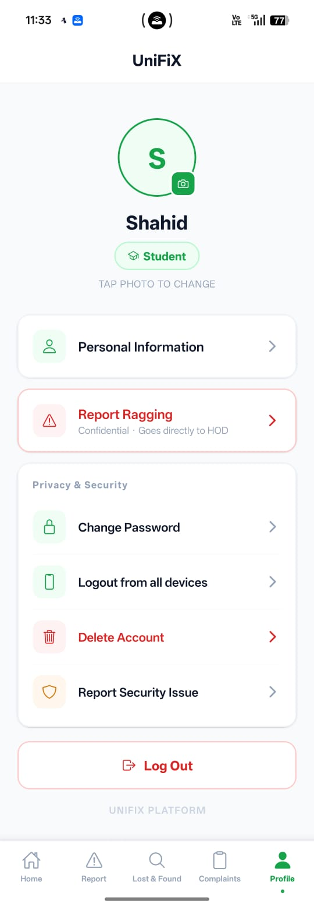
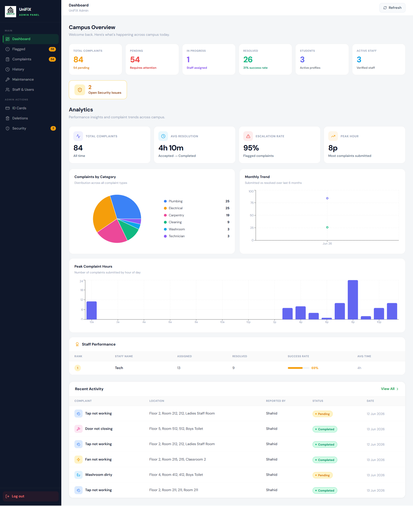
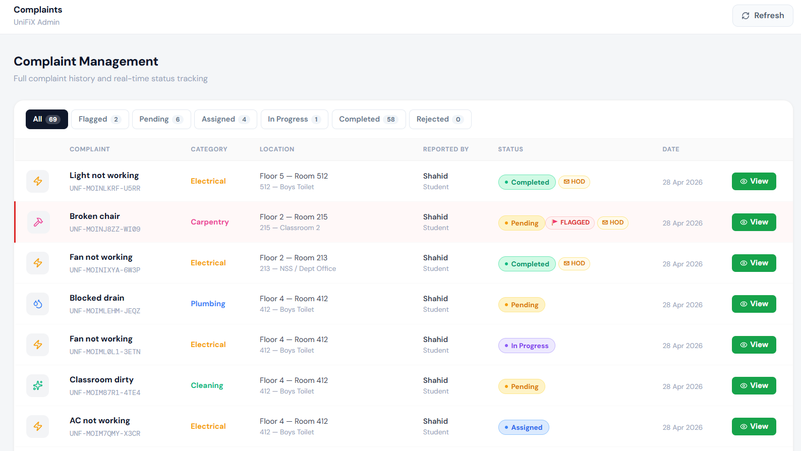

# UniFiX — Campus Complaint Management System

> **Campus Care at Your Fingertips**
> A full-stack campus management system for handling complaints, maintenance workflows, escalations, and lost & found operations within a college environment.

---

## Screenshots

### Student App

| Home | Complaints | Tracking |
|------|------------|----------|
|  |  |  |

| Lost & Found Feed | Found Items | Claims |
|-------------------|-------------|--------|
|  |  |  |

| Profile |
|---------|
|  |

### Admin Panel





---

## Features

### Authentication
- Firebase Authentication (Email/Password)
- OTP-based signup verification
- Password reset with OTP
- Secure token-based API access (Firebase ID token for mobile, JWT for admin panel)

### Complaint System
- Submit complaints with category, location, and optional photo
- Auto-assignment to available staff based on category
- Status tracking: `pending → assigned → in_progress → completed`
- Rejection system — staff can reject; complaint stays pending until all assigned staff reject
- Complaint rating system (disabled when admin resolves directly)
- Time restrictions: complaints can only be submitted between **8 AM – 8 PM IST**

### Escalation & Flagging
- Complaints auto-flagged when unresolved beyond category time limits:
  - Cleaning / Housekeeping / Washroom → **1 hour**
  - Electrical / Plumbing / Civil / Carpentry → **24 hours**
  - Technician / IT / Lab / Safety / Others → **2 hours**
- Flagged complaints trigger **admin push notification**
- After **20 minutes** of no action → **HOD escalation email** sent
- Admin can take ownership via "I Will Handle" → student notified
- Admin can resolve directly via "Mark as Resolved" → HOD resolution email + student notified
- Staff completing a flagged complaint → admin notified + HOD resolution email if previously escalated
- Escalation powered by **BullMQ + Redis** (not setTimeout)

### Lost & Found
- Post found items with image upload (Cloudinary)
- Categorization and descriptions
- Item feed for all users
- Lost report posting
- Handover and claim tracking

### Push Notifications (FCM)
- Complaint status updates → student notified
- New assignments → staff notified
- Escalation events → admin notified
- Notification tap deep-links to relevant screen/tab
- Stale FCM tokens automatically cleaned from Firestore on send failure

### Admin Panel (Web)
- JWT-based admin authentication (separate from Firebase)
- Staff approval / rejection
- Complaint monitoring with flagged/HOD indicators
- Complaint detail modal with full reporter info, progress tracker, assignment
- ID card request management
- Account deletion handling
- Security issue resolution
- Flagged complaints section
- History and overview dashboards

### Performance & Stability
- Firestore real-time listeners kept only where necessary (admin dashboard, staff dashboard, single complaint tracking modal)
- Student complaint list, Lost & Found feed, and claims use REST (not real-time)
- `hasFetchedRef` guard prevents repeated Firestore reads on Firebase auth token refresh (~every 60 min)
- Global skeleton loading system with per-screen skeleton types (dashboard, task, list)
- Minimum 300ms skeleton display to prevent flicker
- Redis error spam suppressed for `ECONNRESET` / `ENOTFOUND`

---

## Tech Stack

| Layer        | Technology                          |
|--------------|-------------------------------------|
| Mobile App   | React Native (Expo), TypeScript     |
| Backend      | Node.js, Express                    |
| Database     | Firebase Firestore                  |
| Auth         | Firebase Authentication + JWT (admin) |
| Admin Panel  | React.js (Vite)                     |
| Image Upload | Cloudinary                          |
| Email        | Nodemailer (Gmail SMTP)             |
| Push Notifications | Expo FCM                      |
| Job Queue    | BullMQ + Redis                      |
| State (Mobile) | Zustand                           |

---

## Project Structure

```
UNIFIX-MAIN/
├── frontend/          # React Native (Expo) mobile app
├── backend/           # Node.js + Express API
└── admin/             # React.js admin panel
```

---

## Setup Instructions

### 1. Clone Repository

```bash
git clone https://github.com/Shahiduddin1710/UNIFIX-MAIN.git
cd UNIFIX-MAIN
```

### 2. Install Dependencies

```bash
cd frontend && npm install
cd ../backend && npm install
cd ../admin && npm install
```

### 3. Install Zustand (Mobile)

```bash
cd frontend
npx expo install zustand
```

---

### 4. Environment Variables

#### Frontend (`frontend/.env`)

```env
EXPO_PUBLIC_BASE_URL=http://YOUR_IP:3000
```

#### Admin (`admin/.env`)

```env
REACT_APP_API_URL=http://YOUR_IP:3000
```

#### Backend (`backend/.env`)

```env
PORT=3000
JWT_SECRET=your_jwt_secret
EMAIL_USER=your_email@gmail.com
EMAIL_PASSWORD=your_app_password
FIREBASE_DATABASE_URL=your_database_url
FIREBASE_STORAGE_BUCKET=your_bucket_url
CLOUDINARY_CLOUD_NAME=your_cloud_name
CLOUDINARY_UPLOAD_PRESET=your_upload_preset
REDIS_URL=your_redis_url
```

---

## Firebase Setup

1. Create a Firebase project
2. Enable:
   - Authentication (Email/Password)
   - Firestore Database
3. Generate a Service Account Key
4. Place the file at:

```
backend/serviceAccountKey.json
```

---

## Run the Project

### Backend

```bash
cd backend
node server.js
```

### Frontend

```bash
cd frontend
npx expo start --clear
```

### Admin Panel

```bash
cd admin
npm run dev
```

---

## Important Notes

- Ensure mobile and backend are on the **same network**
- Update the IP address in `.env` when WiFi changes
- Restart Expo after changing `.env`
- The `hasFetchedRef` guard in `index.tsx` and `my-complaints.tsx` is critical — do not revert it
- `lost-and-found.tsx` intentionally keeps `onSnapshot` (dedicated real-time feed)
- `staff-dashboard.tsx` intentionally keeps `onSnapshot` (staff needs real-time task alerts)
- Admin dashboard intentionally keeps all `onSnapshot` (admin needs real-time oversight)

---

## Firestore Listener Architecture

| Listener | Location | Mode |
|---|---|---|
| All complaints collection | `admin-dashboard.tsx` | ✅ Real-time |
| Pending staff collection | `admin-dashboard.tsx` | ✅ Real-time |
| Admin user doc | `admin-dashboard.tsx` | ✅ Real-time |
| Pending complaints for staff | `staff-dashboard.tsx` | ✅ Real-time |
| Assigned complaints for staff | `staff-dashboard.tsx` | ✅ Real-time |
| Staff user doc | `staff-dashboard.tsx` | ✅ Real-time |
| Single complaint (tracking modal) | `index.tsx` | ✅ Real-time (modal open only) |
| Student complaint list | `index.tsx` | REST |
| Lost & Found feed | `index.tsx` | REST |
| Claims | `index.tsx` | REST |
| Lost & Found feed | `staff-dashboard.tsx` | REST |
| Staff own posts | `staff-dashboard.tsx` | REST |
| Claims | `staff-dashboard.tsx` | REST |

---

## API Flow

```
Mobile App / Admin Panel
        ↓
   API Layer (fetch / axios)
        ↓
   Express Routes
        ↓
   Controllers
        ↓
   Firebase (Auth + Firestore)
        ↓
   BullMQ + Redis (Escalation Jobs)
        ↓
   Nodemailer (HOD / Resolution Emails)
```

---

## Backend Routes (Key)

| Method | Route | Description |
|--------|-------|-------------|
| POST | `/admin/login` | Admin JWT login |
| POST | `/admin/iwillhandle` | Admin takes complaint ownership |
| POST | `/admin/mark-flag-resolved` | Admin resolves flagged complaint |
| GET | `/admin/user/:uid` | Fetch staff user details by UID |
| POST | `/auth/save-push-token` | Save FCM push token |

---

## Roles

| Role    | Access                          |
|---------|---------------------------------|
| student | Submit & track complaints, Lost & Found |
| teacher | Submit & track complaints, Lost & Found |
| staff   | Manage assigned complaints, Lost & Found posts |
| admin   | Full system control (web panel) |

---

## Author

**Shahiduddin**
Email: shahiduddin153@gmail.com
GitHub: [Shahiduddin1710](https://github.com/Shahiduddin1710)

---

*Built for Vidyavardhini's College of Engineering & Technology (VCET)*
