# UniFiX: Campus Complaint Management System

## Download the App

Visit our website to download the latest UniFiX APK:

🌐 **https://unifixapp.vercel.app**

> Download the Android APK directly from the website and start using UniFiX on your device.

---

> **Campus Care at Your Fingertips**
> A full-stack campus management system for handling complaints, maintenance workflows, escalations, and lost & found operations within a college environment.


## Features

### Authentication
- Firebase Authentication (Email/Password)
- OTP-based signup verification
- Password reset with OTP
- Secure token-based API access (Firebase ID token for all roles — student, staff, admin)

### Complaint System
- Submit complaints with category, location, and optional photo
- Auto-assignment to available staff based on category
- Status tracking: `pending → assigned → in_progress → completed`
- Rejection system — staff can reject; complaint stays pending until all assigned staff reject
- Complaint rating system (disabled when admin resolves directly)
- Time restrictions: complaints can only be submitted between **8 AM – 8 PM IST**

### Escalation & Flagging
- Complaints auto-flagged when unresolved beyond category time limits:
  - Cleaning / Housekeeping / Washroom → **1 hour**
  - Electrical / Plumbing / Civil / Carpentry → **24 hours**
  - Technician / IT / Lab / Safety / Others → **2 hours**
- Flagged complaints trigger **admin push notification**
- After **20 minutes** of no action → **HOD escalation email** sent
- Admin can take ownership via "I Will Handle" → student notified
- Admin can resolve directly via "Mark as Resolved" → HOD resolution email + student notified
- Staff completing a flagged complaint → admin notified + HOD resolution email if previously escalated
- Escalation powered by **BullMQ + Redis** (not setTimeout)

### Lost & Found
- Post found items with image upload (Cloudinary)
- Categorization and descriptions
- Item feed for all users
- Lost report posting
- Handover and claim tracking

### Push Notifications (FCM)
- Complaint status updates → student notified
- New assignments → staff notified
- Escalation events → admin notified
- Notification tap deep-links to relevant screen/tab
- Stale FCM tokens automatically cleaned from Firestore on send failure

### Admin Panel (Web)
- Staff approval / rejection
- Complaint monitoring with flagged/HOD indicators
- Complaint detail modal with full reporter info, progress tracker, assignment
- ID card request management
- Account deletion handling
- Security issue resolution
- Flagged complaints section
- History and overview dashboards

### Performance & Stability
- Student complaint list, Lost & Found feed, and claims use REST (not real-time)
- `hasFetchedRef` guard prevents repeated Firestore reads on Firebase auth token refresh (~every 60 min)
- Global skeleton loading system with per-screen skeleton types (dashboard, task, list)
- Minimum 300ms skeleton display to prevent flicker
- Redis error spam suppressed for `ECONNRESET` / `ENOTFOUND`

### Offline-First Architecture (SQLite)
- All dynamic data cached locally using **Expo SQLite** with WAL mode
- **Hash-based incremental sync** — server computes MD5 hash of data; client sends current hash; fetch only happens when hash mismatches (~90% reduction in Firestore reads)
- SQLite tables: `complaints`, `lostfound_items`, `lost_reports`, `claims`, `metadata`
- On app open → SQLite read is instant (no loading screen if cache exists)
- On app resume → silent background sync, UI updates only if data changed
- Sync coverage:

| Data | SQLite Cached | Sync Strategy |
|------|--------------|---------------|
| Student complaints | ✅ | Hash + delta since last sync |
| Staff complaints | ✅ | Hash + delta since last sync |
| Admin complaints | ✅ | Hash + delta since last sync |
| Lost & Found feed | ✅ | Hash-based full sync |
| Lost reports | ✅ | Hash-based full sync |
| Claims | ✅ | Hash-based full sync |
| Admin management screens | ❌ | Direct fetch (sensitive, rare) |

---

## Tech Stack

| Layer        | Technology                          |
|--------------|-------------------------------------|
| Mobile App   | React Native (Expo), TypeScript     |
| Backend      | Node.js, Express                    |
| Database     | Firebase Firestore                  |
| Auth         | Firebase Authentication (Firebase ID token for all roles) |
| Admin Panel  | React.js (Vite)                     |
| Image Upload | Cloudinary                          |
| Email        | Nodemailer (Gmail SMTP)             |
| Push Notifications | Expo FCM                      |
| Job Queue    | BullMQ + Redis                      |
| State (Mobile) | Zustand                           |
| Local Cache    | Expo SQLite (offline-first)       |
| Sync Strategy  | Hash-based incremental sync       |

---


## API Flow

```
Mobile App / Admin Panel
        ↓
   API Layer (fetch / axios)
        ↓
   Express Routes
        ↓
   Controllers
        ↓
   Firebase (Auth + Firestore)
        ↓
   BullMQ + Redis (Escalation Jobs)
        ↓
   Nodemailer (HOD / Resolution Emails)
```

---

## Roles

| Role    | Access                          |
|---------|---------------------------------|
| student | Submit & track complaints, Lost & Found |
| teacher | Submit & track complaints, Lost & Found |
| staff   | Manage assigned complaints, Lost & Found posts |
| admin   | Full system control (web panel) |

---

---

## Setup Instructions

### 1. Clone Repository

```bash
git clone https://github.com/Shahiduddin1710/UNIFIX-MAIN.git
cd UNIFIX-MAIN
```

### 2. Install Dependencies

```bash
cd frontend && npm install
cd ../backend && npm install
cd ../admin && npm install
```

### 3. Install firebaseConfig.ts (Mobile)


You don't "download" `firebaseConfig.ts` — you **create it manually** from your Firebase Console.

---

**Step 1** — Go to [Firebase Console](https://console.firebase.google.com)

**Step 2** — Select your project → **Project Settings** (gear icon)

**Step 3** — Scroll down to **"Your apps"** → select your Android/Web app → copy the config

**Step 4** — Create file `frontend/firebase/firebaseConfig.ts` and paste:

```ts
import { initializeApp } from "firebase/app";
import { getAuth } from "firebase/auth";
import { getFirestore } from "firebase/firestore";

const firebaseConfig = {
  apiKey: "your-api-key",
  authDomain: "your-project.firebaseapp.com",
  projectId: "your-project-id",
  storageBucket: "your-project.appspot.com",
  messagingSenderId: "your-sender-id",
  appId: "your-app-id",
};

const app = initializeApp(firebaseConfig);
export const auth = getAuth(app);
export const db = getFirestore(app);
```

**Step 5** — Replace all `"your-..."` values with your actual Firebase config values.


```

---

### 4. Environment Variables

#### Frontend (`frontend/.env`)

```env
EXPO_PUBLIC_BASE_URL=http://YOUR_IP:3000
```

#### Admin (`admin/.env`)

```env
VITE_API_URL=http://YOUR_IP:3000
```

#### Backend (`backend/.env`)

```env
PORT=port no.
FIREBASE_DATABASE_URL=
FIREBASE_STORAGE_BUCKET=
FIREBASE_API_KEY=
CLOUDINARY_CLOUD_NAME=
CLOUDINARY_UPLOAD_PRESET=
BREVO_API_KEY=
BREVO_SENDER_EMAIL=
HELPDESK_EMAIL=unifix.
HOD_EMAIL=
CRON_SECRET=
SENTRY_DSN=
REDIS_URL=
```

---

## Firebase Setup

1. Create a Firebase project
2. Enable:
   - Authentication (Email/Password)
   - Firestore Database
3. Generate a Service Account Key
4. Place the file at:

```
backend/serviceAccountKey.json
```

---

## Run the Project

### Backend

```bash
cd backend
node server.js
```

### Frontend

```bash
cd frontend
npx expo start
```

### Admin Panel

```bash
cd admin
npm run dev
```

---

### Student App

<p align="center">
  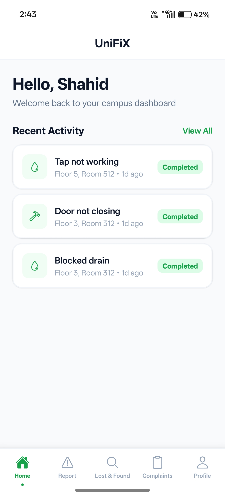&nbsp;
  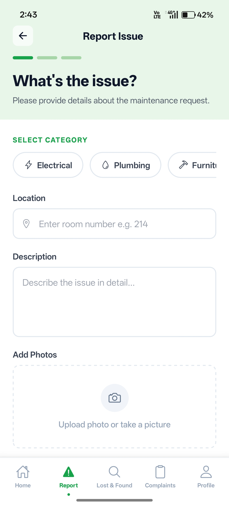&nbsp;
  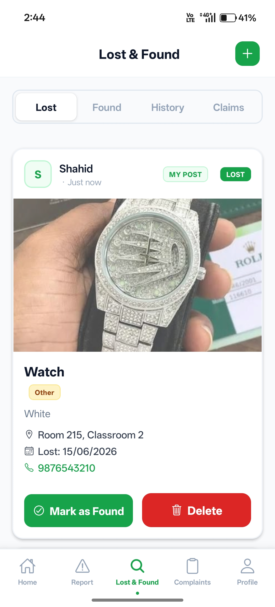&nbsp;
  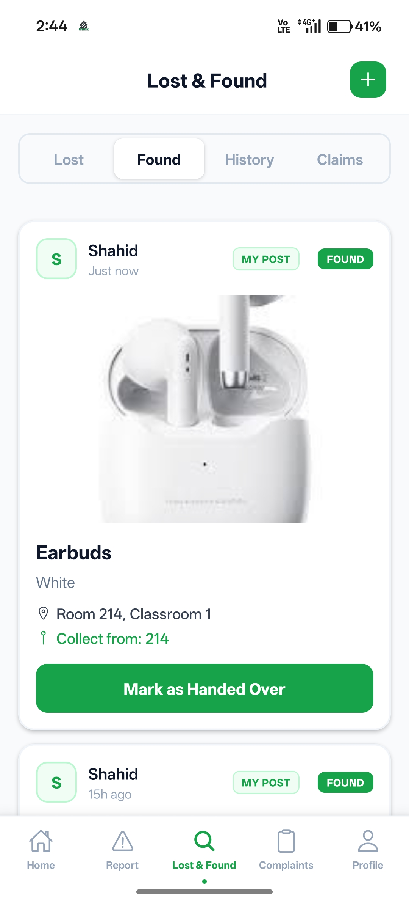
</p>

<p align="center">
  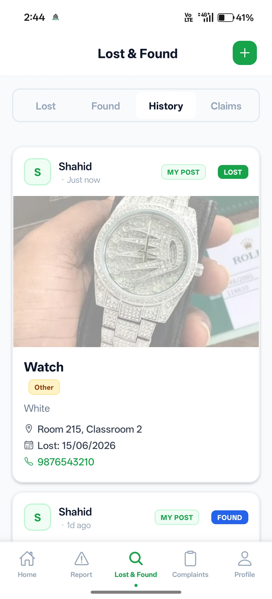&nbsp;
  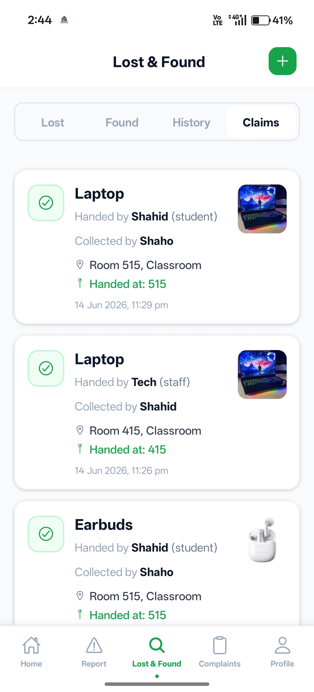&nbsp;
  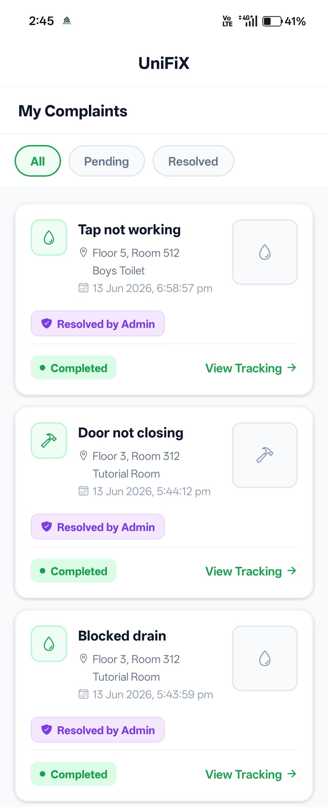&nbsp;
  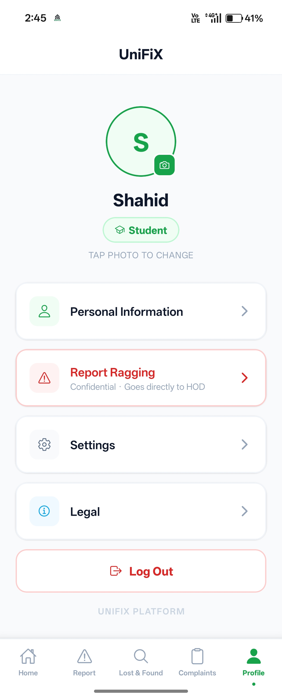
</p>

---

### Staff App

<p align="center">
  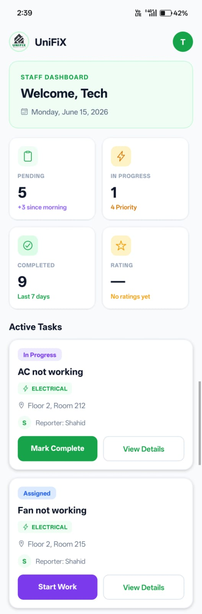&nbsp;
  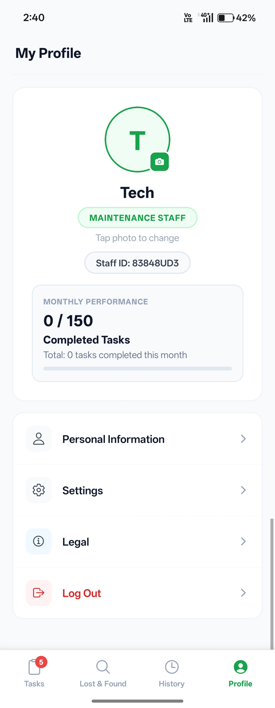&nbsp;
  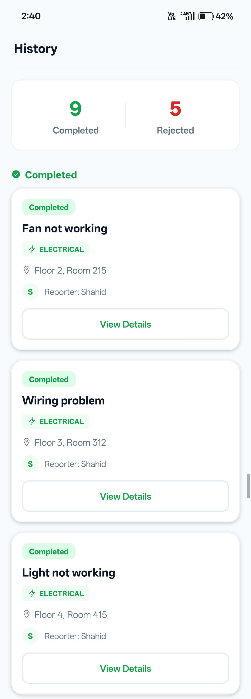&nbsp;
  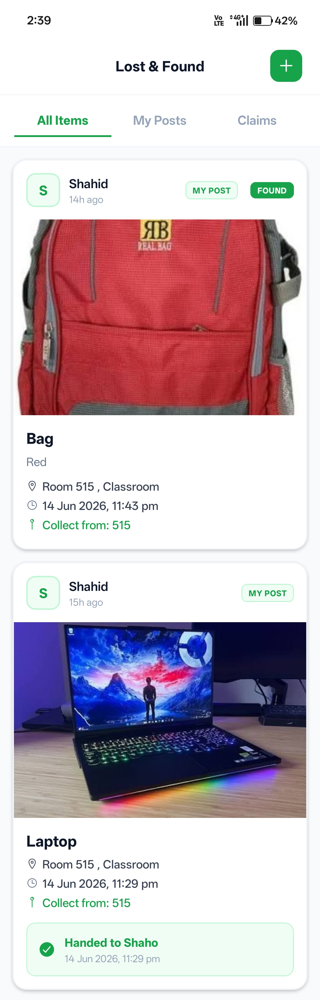
</p>

---

### Admin Mobile

<p align="center">
  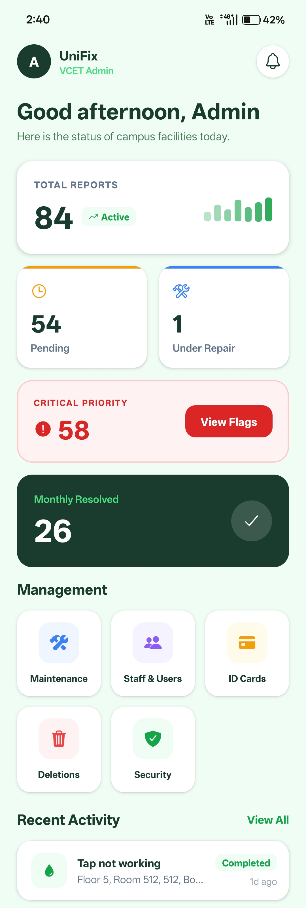&nbsp;
  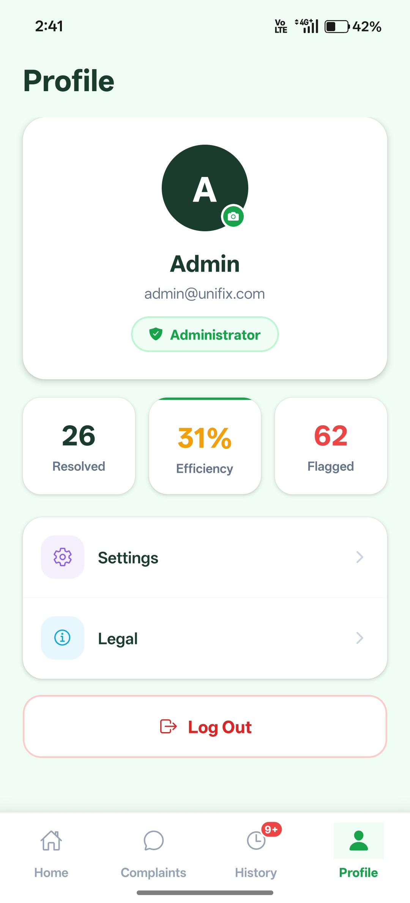&nbsp;
  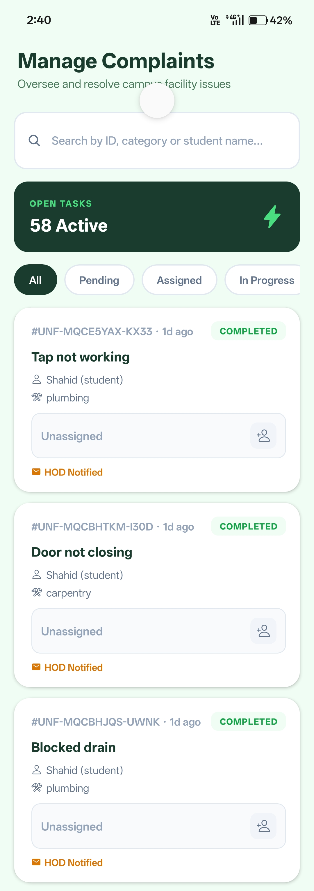&nbsp;
  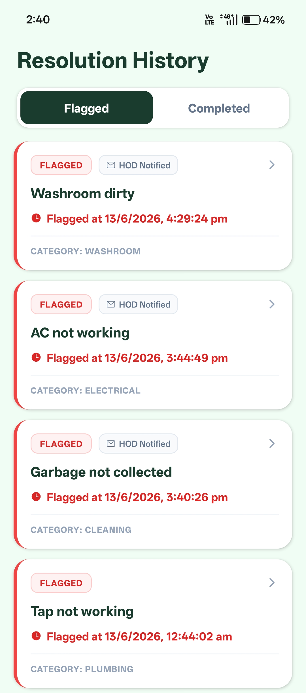
</p>

---

### Admin Web

<p align="center">
  
</p>

## Important Notes

- Ensure mobile and backend are on the **same network**
- Update the IP address in `.env` when WiFi changes
- Restart Expo after changing `.env`
- The `hasFetchedRef` guard in `index.tsx` and `my-complaints.tsx` is critical — do not revert it
- `lost-and-found.tsx` intentionally keeps `onSnapshot` (dedicated real-time feed)
- `staff-dashboard.tsx` intentionally keeps `onSnapshot` (staff needs real-time task alerts)
- Admin dashboard intentionally keeps all `onSnapshot` (admin needs real-time oversight)
- SQLite schema migrations are handled via `migrateComplaintsTable()` in `db/database.ts` — do not remove
- Hash keys are stored in the `metadata` SQLite table — clearing them forces a full re-sync
- To force a full re-sync for any module, call `setMeta('<hash_key>', '')` before syncing

---

## Author

**Shahiduddin**
Email: shahiduddin153@gmail.com

---

*Built for Vidyavardhini's College of Engineering & Technology (VCET)*
